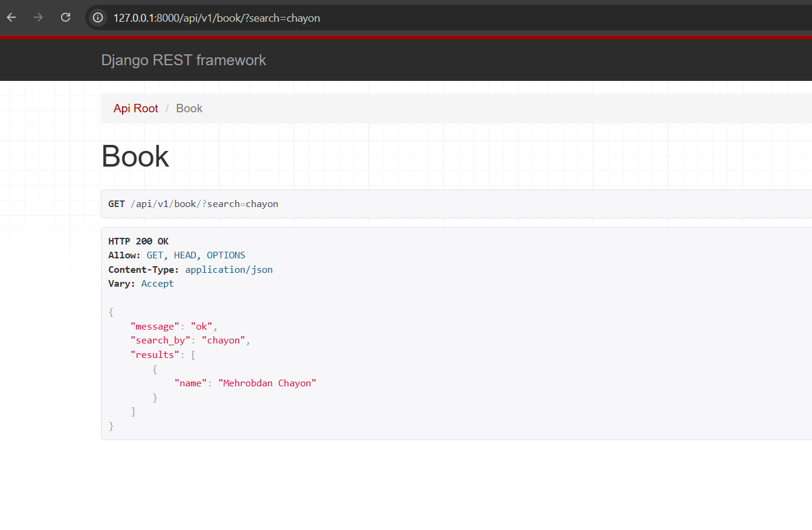
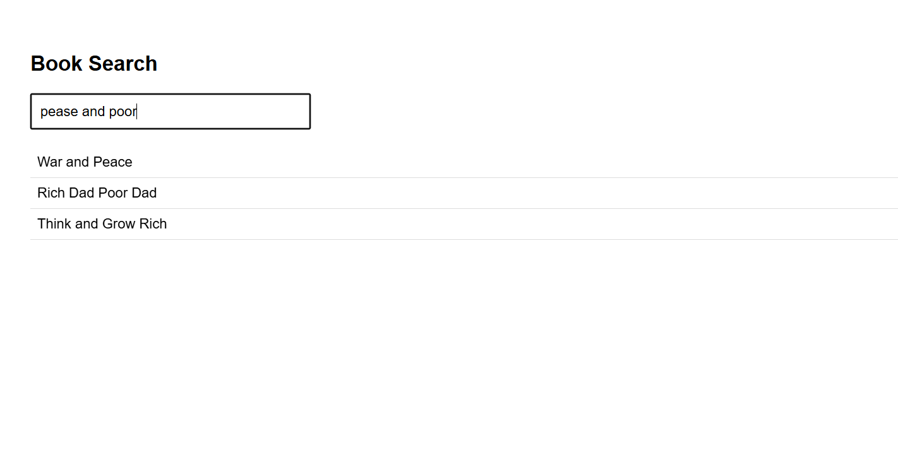

Albatta! Sizning Django loyihangiz uchun `README.md` faylini professional va tushunarli tarzda tuzib bera olaman. Siz aytganingizdek, loyiha **Django REST Framework**, **PostgreSQL**, va **Elasticsearch** ishlatadi, va sizda ikkita natija rasm (`result.png` va `result-api.png`) mavjud. Quyida misol keltiraman:

---

# BACKEND-PROJECT-WITH-DJANGO

Bu loyiha Django REST Framework yordamida backend API yaratish, **PostgreSQL** ma'lumotlar bazasi bilan ishlash, va **Elasticsearch** orqali qidiruvni amalga oshirish uchun mo‘ljallangan.

## 📂 Loyiha tuzilishi

```
src/
├── api/              # API endpointlari
├── apps/             # Django ilovalari
├── config/           # Loyihaning konfiguratsiya fayllari
├── static/           # Statik fayllar
├── templates/        # HTML shablonlar
├── manage.py         # Django manage komandasi
├── Dockerfile        # Docker imiji uchun
├── docker-compose.yml# Docker compose fayli
├── requirements.txt  # Python kutubxonalari
├── .env              # Muhit o'zgaruvchilari
└── db.sqlite3        # SQLite DB (dev uchun)
```

## ⚙️ Texnologiyalar

* **Python 3.11+**
* **Django 4+**
* **Django REST Framework**
* **PostgreSQL** – asosiy ma’lumotlar bazasi
* **Elasticsearch** – qidiruv va filtrlar uchun
* **Docker & Docker Compose** – konteynerizatsiya

## 🚀 Loyihani ishga tushirish

1. Loyiha nusxasini yuklab olish:

```bash
git clone <repository-url>
cd BACKEND-PROJECT-WITH-DJANGO
```

2. Virtual muhiti yaratish va kutubxonalarni o‘rnatish:

```bash
python -m venv venv
source venv/bin/activate  # Linux / MacOS
venv\Scripts\activate     # Windows
pip install -r requirements.txt
```

3. `.env` faylini sozlash:

```
SECRET_KEY=<sizning_secret_key>
DEBUG=True
DB_NAME=<postgres_db_name>
DB_USER=<postgres_user>
DB_PASSWORD=<postgres_password>
DB_HOST=<db_host>
DB_PORT=5432
ELASTIC_HOST=http://localhost:9200
```

4. Ma’lumotlar bazasini migratsiya qilish:

```bash
python manage.py makemigrations
python manage.py migrate
```

5. Serverni ishga tushirish:

```bash
python manage.py runserver
```

6. Docker orqali ishga tushirish (ixtiyoriy):

```bash
docker-compose up --build
```

## 🔍 Elasticsearch

* Elasticsearch qidiruvini faollashtirish uchun `src/config/settings.py` faylida `ELASTIC_HOST` sozlangan bo‘lishi kerak.
* Model ma’lumotlarini indekslash uchun:

```bash
python manage.py search_index --rebuild
```

## 📦 API

* Loyihada Django REST Framework orqali API endpointlar mavjud.
* Misol so‘rov:

```
GET /api/books/
```

Natijasi:



## 🌐 Frontend Natija

Frontend interfeys natijasi:



## ✅ Qo‘shimcha

* Loyihada JWT autentifikatsiya qo‘llanilgan.
* CRUD amallarni API orqali bajarish mumkin.
* Elasticsearch orqali tez qidiruv va filtrlar.
